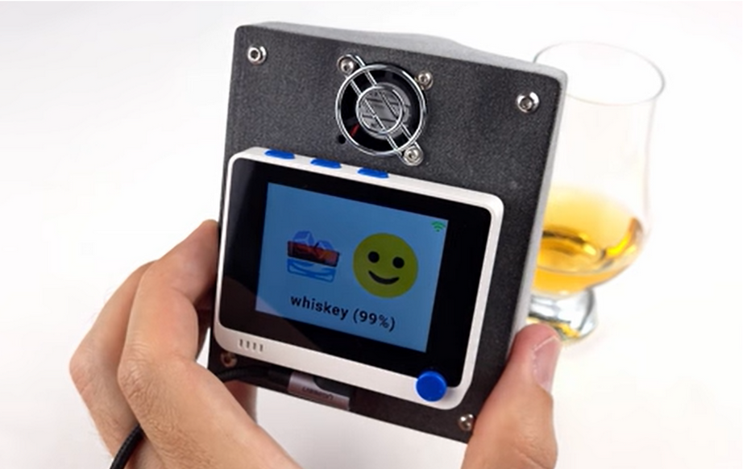
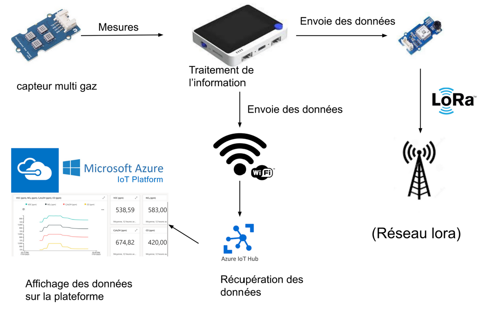
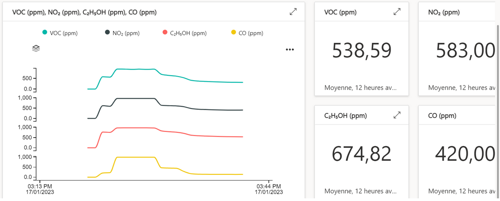
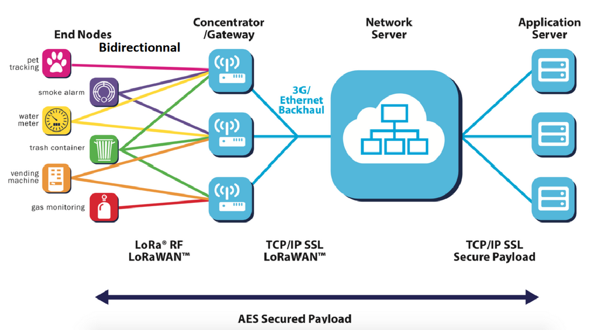

# Rapport IoT 

# Artificial Nose

# 

# Présentation globale du produit :  {#présentation-globale-du-produit}

Comme chaque année, les étudiants IESE5 doivent réaliser un projet en lien avec l’IoT. Ces projets sont à choisir parmi une liste prédéfinie. Le but étant d’étudier le prototypage d’un objet connecté et d’un service associé.

Parmi les projets, nous avons choisi le projet “Artificial Nose”. Ce projet est à l’origine réalisé par [Benjamin Cabé](https://blog.benjamin-cabe.com/2021/08/03/how-i-built-a-connected-artificial-nose). Ce nez artificiel est constitué de divers composants : 

* Un boitier imprimé en 3D
* Un ventilateur 5 V
* Un [Wio terminal](https://wiki.seeedstudio.com/Wio-Terminal-Getting-Started/)
* Un [Wio terminal accessories](https://wiki.seeedstudio.com/Wio-Terminal-Chassis-Battery(650mAh)/) (châssis Wio)
* Un capteur[ Grove Multichannel Gas Sensor ](https://wiki.seeedstudio.com/Grove-Multichannel-Gas-Sensor-V2/)

 

### Figure 1 : Artificial Nose en train de reconnaître du whisky 

Le principe est simple : grâce au capteur multigaz et à une IA préalablement entraînée, le Wio terminal est capable de déterminer la source de l’odeur parmi un ensemble prédéfini (café, pain, certains alcools forts…).  Les concentrations des différents gaz détectés sont envoyée par wifi sur AzureIoT

# Analyse du marché  {#analyse-du-marché}

Avant d’analyser l’architecture du système, faisons une analyse rapide des produits concurrents.

Tout d’abord, il faut savoir que la détection d’odeurs n’est pas un nouveau concept, le premier olfactomètre daterait de [1888](https://www.cairn.info/revue-l-annee-psychologique-2021-3-page-311.htm). Toutefois, il faut savoir qu’on ne sait pas faire de capteur qui remplacerait un nez humain. En effet, un olfactomètre permet de mesurer la quantité d’un composé chimique dans l’air, mais cela ne revient pas à mesurer une odeur. Une odeur est un mélange de plusieurs composés chimiques et il n’existe pas de méthode pour déterminer avec certitude l’odeur que produit un certain un mélange de composés chimiques.

Il existe donc plein de d’olfactomètres qui permettent de détecter une trace chimique dans l’air. Ce sont des appareils spécialisés qui ne détectent au mieux que quelques traces chimiques (comme par exemples les traces de produits utilisés pour faire des explosifs, détecteurs de monoxyde de carbone, etc). 

Notre produit, issu d’un projet DIY, n’a donc pas d’équivalent commercial car ça ne sert typiquement à rien. Notre nez artificiel n’a aucun ne permet en aucun cas d’identifier une odeur avec certitude, les cas de faux positifs sont trop nombreux.

# Architecture globale {#architecture-globale}

Tout d’abord, analysons le fonctionnement de base prévu par le créateur de ce projet : 

### Figure 2 : Architecture globale du système

Dans le schéma ci-dessus, on peut voir que notre Wio terminal communique en wifi directement au serveur Azure IoT. Ce qui nous permet d’avoir les résultats directement sur un tableau de bord intégré au service Azure.

### Figure 3 : Tableau de bord Azure

Toutefois, dans ce projet, nous avons tenté d’ajouter une communication LoRa, à la liste du matériel définie dans la présentation globale s’ajoute donc un capteur [Grove LoRa E5](https://wiki.seeedstudio.com/Grove_LoRa_E5_New_Version/). Ce composant permet de communiquer en LoRa à la gateway la plus proche situé dans l’université. Grâce au protocole LoRaWAN, notre message est transmis de la  manière suivante : 

## 

### Figure 4 : Architecture du réseau LoRaWAN

Notre message, partant de l’émetteur Grove E5, est reçu par une gateway qui communique avec un serveur, puis, grâce à chirpstack, on interprète ces messages.

# Risque d’atteinte au respect de la vie privée {#risque-d’atteinte-au-respect-de-la-vie-privée}

Dans notre projet, nous n’avons établi aucune mesure concernant la protection des données transmises. La RGPD n’est donc pas respectée, bien que l’on pourrait admettre que les données relevées par le nez artificiel ne sont pas forcément sensibles…

# Coût de la BOM (Bill Of Materials) {#coût-de-la-bom-bill-of-materials}

Les coûts de tous les composants sont les suivants : 

* $16  Grove LoRa E5
* $30 Grove Multichannel Gas Sensor
* $37 Wio terminal
* $25 Wio terminal accessories
* $10 PLA + électricité
* $5 ventilateur 5 V

	Bien que l’on pourrait argumenter qu’il serait insensé de produire 5000 exemplaires d’un produit comme ça avec des plateformes de développement (ce serait comme vendre un produit avec une Arduino dedans), on peut tout de même estimer le prix d’un kit qui contiendrait tous les composants nécessaires. Ce prix serait de $123 sans la livraison. 

# Coût de la certification  {#coût-de-la-certification}

Le prix d’une certification LoRa Alliance est à -50 % en ce moment ! Seulement $1000, c’est le moment d’y aller !

# Autonomie de l’objet {#autonomie-de-l’objet}

L’autonomie de la batterie est d’environ 3h car l’appareil est équipé d’un écran et que le code ne prévoit pas d’éteindre l’écran… Cependant, même si on pouvait éteindre l’écran, il ne faudrait pas s’attendre à plus d’une journée d’autonomie avec le ventilateur qui tourne en permanence et le capteur de gaz qui a besoin de chauffer pour fonctionner…

# Cycle de vie du produit {#cycle-de-vie-du-produit}

Notre nez artificiel à une durée de vie relativement longue. Ses composants étant tous électroniques et n’ayant aucun composant consommable, on peut tout à fait l’utiliser pendant de nombreuses années, sa durée de vie va surtout être corrélée avec l’intérêt qu’on va avoir de lui.

En regardant chacun des composants du nez, nous pourrons mieux nous rendre compte de leur durée de vie :

- On peut premièrement considérer que le WIO Terminal peut être recyclé dans d’autres projets. Quant à sa durée de vie, elle dépend beaucoup de l’utilisation que l’on va en avoir. En l’utilisant dans des conditions parfaites, sa durée de vie peut être approximée à celle d’une carte Arduino bien connu du grand publique et pouvant être utilisé pendant 5 à 10 ans. Le principal problème serait la batterie qui quant à elle a une durée de vie proche des 3,8 ans. Nécessitant un remplacement et ne pouvant pas être recyclé efficacement.

- Le capteur multigaz et le module LoRa de même peuvent réutiliser dans d’autres projets et ainsi être recyclé. Leurs durées vie vont être corrélées avec le soin que l’on va prendre de ces composants et le milieu dans lequel ils vont être entreposés (poussières, humidité, etc..), qui va avoir un impact direct sur leurs fonctionnements (court-circuit…).

- L’élément le plus propice à ce dégradé est la coque imprimée en PLA (notamment en cas d’expositions aux UV et/ou à l’humidité).Sa durée de vie peut être estimée à 1- 2 années. Et de plus, il a peu de chance d’être réutilisé ailleurs.

# Métrique du logiciel embarqué  {#métrique-du-logiciel-embarqué}

Le code fournit par Benjamin Cabé fait 742 lignes. Auquel nous avons dû apporter plusieurs modifications pour essayer d’ajouter la communication LoRa. Le code est alors arrivé à 972 lignes.

Un autre fichier précompilé de 1 Mo était également fourni pour tester notre nez.
